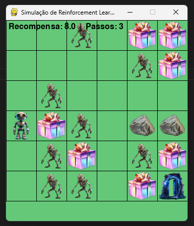

Reinforcement Learning – IA Project

  

--------------------------------------------------------------------
Projeto desenvolvido para a disciplina de Inteligência Artificial
(URI Erechim – 2025/2), ministrada pelo professor Lucas Bucior. 
O objetivo é treinar um agente capaz de navegar em um grid, 
coletar suprimentos, evitar zumbis e alcançar a área segura 
utilizando Q-Learning.

🎯 Objetivo Geral

Treinar um agente inteligente capaz de:

• Coletar todos os suprimentos

• Evitar zumbis e paredes

• Minimizar o número de passos

• Atingir a área segura com a maior recompensa possível

--------------------------------------------------------------------
🛠 Tecnologias Utilizadas

• Python 3.12

• Pygame

• Reinforcement Learning (Q-Learning)

• Próprio motor de simulação

-----------------------------------------------------------------------------------------------

🌎 Modos de Ambiente

Modo	Descrição:

• A	Mapa fixo 1 – grid manual

• B	Mapa fixo 2 – grid manual

• CUSTOM	Mapa definido pelo usuário

• RANDOM	Mapa totalmente aleatório

-----------------------------------------------------------------------------------------------

💰 Sistema de Recompensas

| Evento                      | Recompensa |
| --------------------------- | ---------- |
| Andar                       | -1         |
| Coletar suprimento          | +10        |
| Chegar à saída              | +20        |
| Ser atacado por zumbi       | -10        |
| Ir à porta sem coletar tudo | -1         |

-----------------------------------------------------------------------------------------------

📁 Estrutura do Projeto

• main.py – Executa, treina e testa o agente

• simulator.py – Gerencia o ambiente e o grid

• learner.py – Implementa o Q-Learning

• utils.py – Funções auxiliares

• assets/ – Imagens

• README.md – Documentação do projeto

-----------------------------------------------------------------------------------------------

▶️ Como Executar

1. Clone o repositório:

   git clone https://github.com/joaorossetto10/ReinforcementLearning.git
   
2. Instale dependências:
 
   pip install pygame
   
3. Execute:

   python main.py

-----------------------------------------------------------------------------------------------
   
🏆 Resultados Esperados

• Coletar todos os suprimentos

• Evitar os zumbis

• Terminar com alta recompensa (ex.: 80 pontos)

• Seguir o caminho ótimo aprendido

-----------------------------------------------------------------------------------------------

👤 Autor

João Vitor Rossetto

GitHub: https://github.com/joaorossetto10

-----------------------------------------------------------------------------------------------

🎓 Créditos

Baseado nas orientações do Prof. Lucas Bucior. Frozen Lake e Q-Learning serviram como referência.

-----------------------------------------------------------------------------------------------
